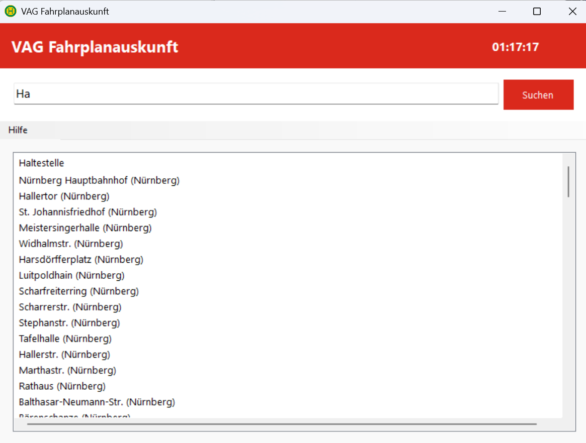

# VAG Fahrplanauskunft

Eine Windows-Anwendung zur Anzeige von Echtzeitdaten für Abfahrten der Verkehrs-Aktiengesellschaft Nürnberg (VAG).

## Features

- Haltestellensuche mit Autocomplete-Funktion
- Echtzeit-Abfahrtsanzeige mit farblicher Kennzeichnung verschiedener Verkehrsmittel
- Anzeige von Wagennummern, wenn verfügbar
- Aktuelle Uhrzeit im Kopfbereich
- Druckfunktion für Abfahrtszeiten

## Installation

1. Lade die neueste Version des Installers aus dem [Releases-Bereich](https://github.com/oli03ba/VAG-Fahrplanauskunft/releases) herunter
2. Führe die heruntergeladene .msi-Datei aus
3. Folge den Anweisungen des Installationsassistenten

## Systemanforderungen

- Windows 7 oder höher
- .NET Framework 4.7.2 oder höher

## Entwickelt von

Oliver Schlegel, Bamberg
